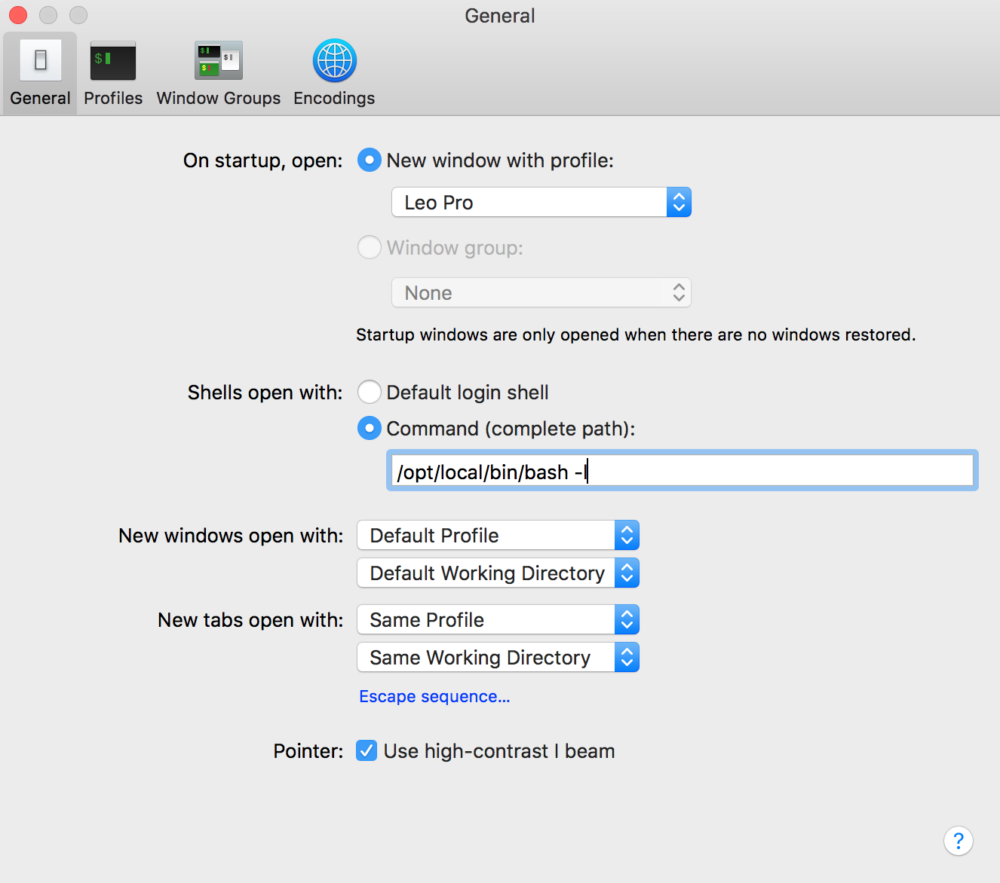

# profile

## Requirements

 - OSX 10.12.3
 - [Docker for Mac](https://download.docker.com/mac/stable/Docker.dmg) ⇒ docker 17.06 
 - [MacPorts](https://guide.macports.org/#installing) 2.4.1
 - GNU bash 4.4.12 (x86_64-apple-darwin16.4.0) 
 - MacPorts [bash-completion](https://trac.macports.org/wiki/howto/bash-completion)

## Setup

### Install

```bash
bash <(curl -fsSL https://goo.gl/ZrXq41)
```

### Open `Terminal.app` ⇒  ⌘,
